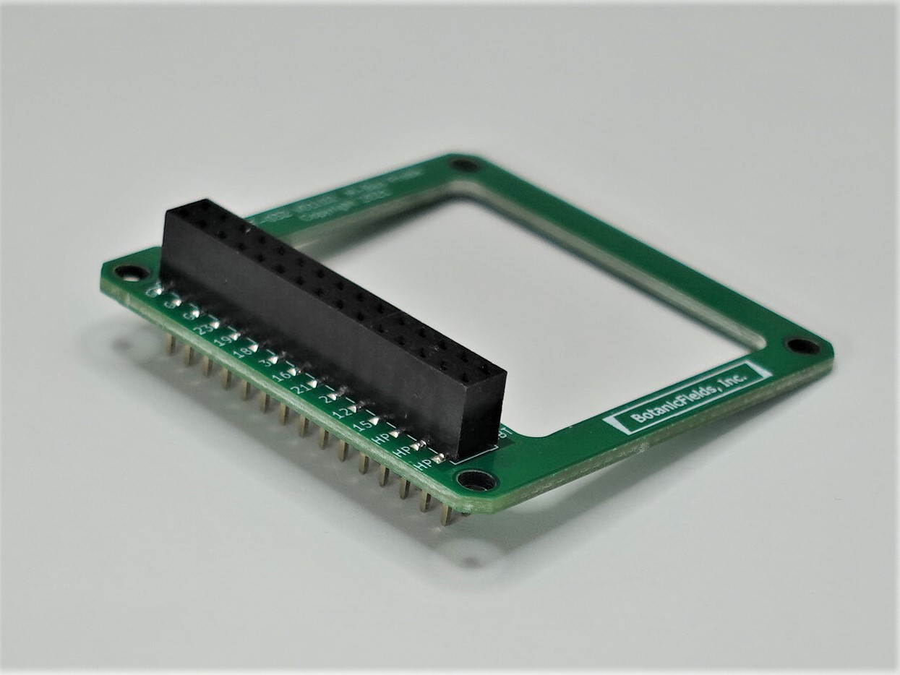
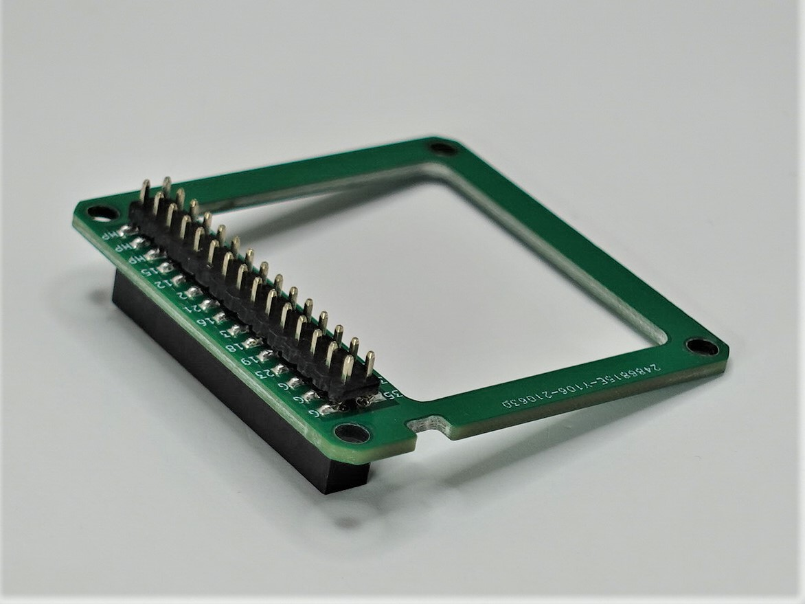
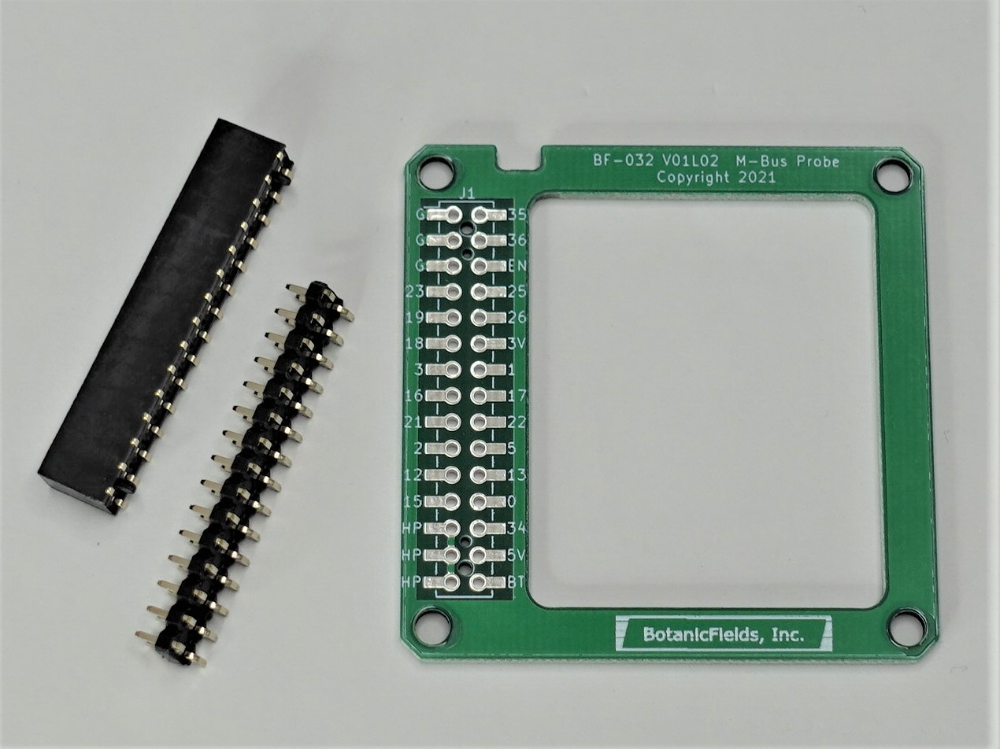
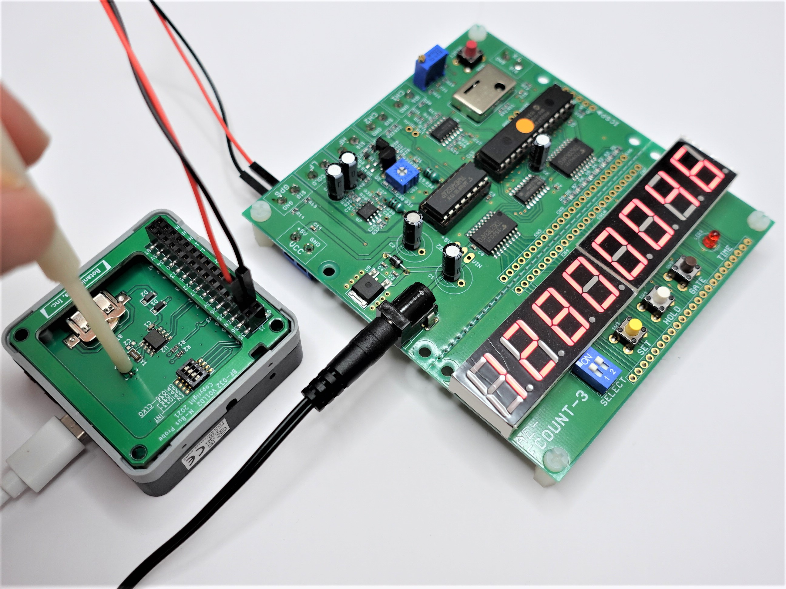

# PCB-MBUS-Probe
a Printed Circuit Board to Probe M-Bus of M5Stack

# M-Busプローブ基板キット
M5StackのM-Bus信号をピンソケットに取り出すプローブ基板のキットです。M-Busモジュールに重ねて取り付けて使用します。
- ブレッドボード用のジャンパーワイヤーを直接挿せます。
- M-Bus信号を観測しながらのM-Busモジュールの調整や試験が、プローブ基板の開口部からできます。
- ボトムに出ていないM-Bus信号を観測できます。

 

## 内容物
- プリント基板 ×1
- M-Bus用ピンヘッダ(M5Stack純正品) ×1
- ピンソケット(SMD一般用15ピン2列) ×1

## ご注意
- 組み立てには、はんだ付け（表面実装）が必要です。
- 取り扱い説明書はありません。

## 使用例
RTCモジュールのCLKO信号を、M-Busプローブ基板のGPIO36から取り出して周波数カウンタで観測しながら、RTCモジュールの水晶発振子のトリマを調整しています。

